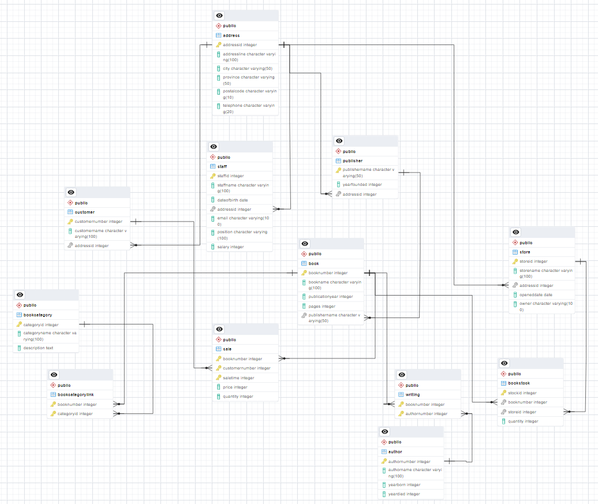

# Good Reading Bookstore

This project was created as part of an assignment for the Database Technology course.

## Project Overview

- **Database:** The project includes a PostgreSQL database schema that represents a bookstore's data model. The schema design is inspired by the well-known Sakila database.

- **Web Application:** The web application is built using the Python Flask framework, and it serves as the user interface for interacting with the database. Users can perform various bookstore-related database operations through the web interface.

- **Database Schema:** Entity Relationship Diagram of Good Reading Bookstore

